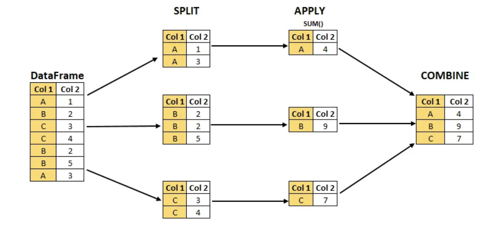

# Amazon Electronics Reviewer Value 
This is the repository for Camaron Mangham and Vinu Lakkur's Milestone 1 Project | University of Michigan School of Information | Master of Applied Data Science

This Milestone focuses on data manipulation and data exploration.

## Background
Our goal was to assess “reviewer lifetime value” and larger trends in spend volume by analyzing reviews of Amazon purchases. The Amazon reviews dataset contains 233.1 million reviews across all categories of product, so we will only focus on a subset of the electronics category, which only contains about 6.7 million records (the full electronics dataset contains almost 21 million records). The results of such analysis could provide insight into the characteristics of different customer groups that leave reviews for items. This information could also be compared and contrasted with other groups of customers such as those that do not leave reviews. In a business setting, such information could be valuable in order to determine how much business effort to put toward either capturing or communicating with certain sets of reviewers/customers. Overall, the motivation for this analysis is inspired by the common practice of determining customer lifetime value (CLV) to understand customer segments and build customer relationships[3-4], and a desire to apply big data and data mining concepts.

## Key Findings and Challenges
- Storing this large data in memory was not viable, and required the leveraging of distributed data processing via PySpark.
- Compressed files must be decompressed to take advantage of distributed processing via PySpark.
- A majority of the reviews are from 2014-2017 which marks a period of rapid growth for Amazon.
- Median spending by reviewers is around $11 on average. Further analysis could be performed regarding price category and review count correlation. 
- Information about a reviewers first Amazon review gives us marginal predictive value regarding their Lifetime Value as a Reviewer
- Initial analysis suggests there is potential for further feature engineering and modeling to yield higher, - and more useful, predictive ability 

## Keywords 
Consumer Behavior, Product Reviews, Amazon Electronics, Customer Lifetime Value, Big Data, Predictive Value

## Data Sources
The datasets, derived from a dataset of Amazon product reviews developed by researchers at UC San Diego, available as compressed JSON files via download at: https://nijianmo.github.io/amazon/index.html:

- Amazon Electronics Reviews 5-core (4.19 GB JSON): Contains 6,739,590 user reviews from 1999 to 2018. These data have been reduced to extract the k-core, such that each of the remaining users and items have k reviews each 
- Amazon Electronics transaction metadata (11 GB JSON): Includes descriptions, price, sales-rank, brand info, and co-purchasing links for 786,868 products.

## Using these notebooks
This project was built in MacOS and Windows OS. Dependencies are available as *environment.yml* and *requirements.txt*. 

Data samples are provided for reference (first 100 rows of both original sets and the dataset engineered for analysis), but it will be necessary to download the original files to replicate the notebooks in their entirety.

## Data Manipulation Methods

Loading these large datasets into the typical Pandas workflow requires a sizable fraction of memory on our local machines and quickly becomes unwieldy. To prepare these large datasets for analysis, we leveraged distributed data processing with the **PySpark API**. Spark provides an analytics engine that represents a dataset as a collection of elements partitioned across the nodes of the cluster that can be operated on in parallel.

By utilizing the SparkContext and partitioning the data across machine cores (worker nodes), we significantly accelerate our data manipulation and analysis:

    

In addition to leveraging distributed processing with PySpark, we also leveraged the Split-Apply-Combine strategy to rapidly group, aggregate, and transform the data (primarily by year, product, and reviewer) into a format suitable for exploratory analysis with Pandas and visualization with Altair.

    

An example of the final dataset is below:

    

## Data Analysis

Descriptive statistics including the number of reviews, the number of reviewers, and the distribution of reviewer spending were generated for each year of data.

    

    

A majority of the reviews and spending fall between 2014-2017 which marks a period of rapid growth for Amazon. **Key events during this time include a partnership with the US Postal Service for Sunday deliveries in 2014, the acquisition of a live streaming platform Twitch in 2014 (100 million monthly users in 2015), and the acquisition of Whole Foods in 2017.**

    

Median spending by reviewers is close to $11 on average, with the trend being mostly consistent each year.

Further analysis could provide insight as to how the price category (cheap, average, expensive) correlates with the volume of reviews.

## Reviewer Lifetime Value

To explore reviewer lifetime value (LTV), first we needed to prepare our cleaned electronics data to engineer the new features and prepare it for a regression analysis. We built a table using a combination of grouping by reviewerID and aggregating the total price of the products they reviewed in the dataset to develop our LTV feature. Theres features include:
- LTV: Total money each customer has spent on the products they reviewed
- Star rating for customers' first review
- Length of customers' first review
- Price of the first product customer reviewed
- Main category of the first product customer reviewed

An example table is below:

    

We used Spark’s machine learning library to run a linear regression on LTV (Total Spend). While we considered other tools, such as scikit-learn, using Spark proved to be the most workable solution considering the size of our dataset. We vectorized the dataset into two columns, split it into a training and testing set, and fit the model to the training set then used the fitted model to predict values for the holdout test set.

The model explained variability in the data with mixed results (RMSE: 274.590376; r2: 0.384534).

    

Ultimately the features we created were able to add some predictive value regarding reviewers’ LTV. The R2 value of 0.38 showed this. However, we don’t feel it was a smoking gun in terms of predicting future LTV in order to make business decisions. Additionally, price of firrst product reviewed was the biggest determinant of future LTV, and that could potentially be because some reviewers only reviewed one product, and, in those cases, price of first product reviewed is equal to their LTV.

## Summary

While it was a successful first attempt, there are clear areas we’ve identified that can be improved upon immediately:
- Incorporating categorical variables (product category - which we didn’t get to use in this first model, using Star Rating as a category) into our model.
- Diving deeper into the subset of users for which the model does seem to predict more accurately (see the diagonal trend on the scatter chart).
- Creating other variables that may have more explanatory power, such as # of reviews left in the first month, or using total number of reviews as a proxy for LTV instead of total spend.

This is a rich dataset with much potential for addtional exploration/analysis. The full details of the report can be viewed in the pdf.